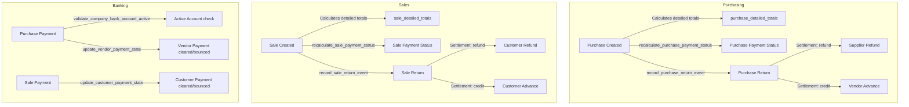

# Implemented Accounting Rules Reference

This document serves as a comprehensive, fact-based mapping of the currently implemented accounting rules in the inventory management application. All mappings are derived directly from the `AccountingService` facade, the rules submodules inside `modules/accounting/current_rules/`, the database repository layers, and the corresponding unit/integration tests in `tests/accounting`.

---

## 1. Executive Summary & Goals
The objective of this reference guide is to document the exact financial logic, credit rules, validations, and ledger updates currently implemented in the system. The goal is to provide a non-judgmental baseline of the current system state, highlighting:
- The precise file paths and line numbers governing financial flows.
- The corresponding test coverage demonstrating expected system behavior.
- Any architectural discrepancies, untested areas, or unimplemented stubs.

---

## 2. Scope & Methodology
This documentation is strictly read-only and does not modify any source code or database schemas. The analysis was conducted by:
1. Tracing the methods in `modules/accounting/service.py`.
2. Inspecting the submodules in `modules/accounting/current_rules/` and `modules/accounting/validators.py`.
3. Analyzing the test coverage in `tests/accounting/` (45 test files).
4. Extracting key SQL views and queries from `database/schema.py` and repository classes.

---

## 3. Domain Overview
The application structures its accounting logic across the following seven key subdomains:
- **Purchase (PUR)**: Financial totals, invoice details, returns, and outstanding liabilities on vendor purchases.
- **Vendor (VND)**: Advances, cash payments, statement ledger aggregation, and FIFO credit allocations.
- **Sales (SAL)**: Sales totals, returns, overpayments, clearing state transitions, and COGS/profit calculations.
- **Customer (CUST)**: Advances, credit applications, timeline generation, customer statements, and receivables summaries.
- **Expense (EXP)**: Expense and category lifecycle validations, dashboard metrics, and P&L summaries.
- **Bank & Cash (BANK)**: Cash movement ledgers, active company bank accounts, and bank account validation checks.
- **Inventory (INV)**: Inventory valuation updates, movement logs, and costing triggers.

---

## 4. Centralized Accounting Service (AccountingService)
The `AccountingService` class, defined in `modules/accounting/service.py`, acts as a central facade for all financial and accounting operations in the application. It receives a SQLite connection object (`conn`) and delegates operations to specific functions within the `current_rules` submodules:
- `purchase_rules.py`
- `vendor_rules.py`
- `sales_rules.py`
- `customer_rules.py`
- `expense_rules.py`
- `inventory_rules.py`
- `bank_rules.py`

This design isolates accounting calculations from views and controllers, route-handling logic, and domain-specific entities.

---

## 5. Purchase Accounting Rules (PUR)

### PUR-RULE-001: Purchase Financials Aggregation
- **Definition**: Calculates net total, paid amount, applied advances, returned value, cleared direct payments, prior refunds, and outstanding balance for a purchase.
- **Confidence**: High
- **Implementation**: `modules/accounting/current_rules/purchase_rules.py#get_purchase_financials` (L208-L274)
- **Test Reference**: `tests/accounting/test_vendor_purchase_outstanding.py` (`test_purchase_outstanding_matches_repo_remaining_due`), `tests/accounting/test_vendor_purchase_purchase_totals.py`
- **Call Sites**: `AccountingService.get_purchase_financials`

### PUR-RULE-002: Purchase Invoice Financials Context
- **Definition**: Aggregates vendor contact information, item lines (with discount and line totals), total order discount, paid/applied credit, and chronological payment history to build the invoice layout context.
- **Confidence**: High
- **Implementation**: `modules/accounting/current_rules/purchase_rules.py#get_purchase_invoice_financials` (L39-L157)
- **Test Reference**: `tests/accounting/test_vendor_purchase_invoice_financials.py`
- **Call Sites**: `AccountingService.get_purchase_invoice_financials`

### PUR-RULE-003: Purchase Return Event Processing
- **Definition**: Handles purchase returns. Validates item availability in stock (via `v_stock_on_hand` view in base units), calculates return value factoring order discount (`return_value_factor = (subtotal - order_discount) / subtotal`), determines `settlement_amount` based on amount funded vs. post-return total, and processes settlement either as cash refund or vendor credit advance.
- **Confidence**: High
- **Implementation**: `modules/accounting/current_rules/purchase_rules.py#record_purchase_return_event` (L323-L645)
- **Test Reference**: `tests/accounting/test_vendor_purchase_return_event.py`, `tests/accounting/test_vendor_purchase_return_valuation.py`
- **Call Sites**: `AccountingService.record_purchase_return_event`

### PUR-RULE-004: Purchase Return Totals
- **Definition**: Computes the total quantity and valuation of all returned items for a specific purchase.
- **Confidence**: High
- **Implementation**: `modules/accounting/current_rules/purchase_rules.py#get_purchase_return_totals` (L312-L320)
- **Test Reference**: `tests/accounting/test_vendor_purchase_return_valuation.py`
- **Call Sites**: `AccountingService.get_purchase_return_totals`

### PUR-RULE-005: Purchase Returnable Quantities
- **Definition**: Inspects the quantities already returned to find the remaining returnable quantity for each item line.
- **Confidence**: High
- **Implementation**: `modules/accounting/current_rules/inventory_rules.py#get_purchase_returnable_quantities` (L169-L191)
- **Test Reference**: `tests/accounting/test_vendor_purchase_return_valuation.py`
- **Call Sites**: `AccountingService.get_purchase_returnable_quantities`

### PUR-RULE-006: Purchase Payment History & Summary
- **Definition**: Returns chronological direct payments for a purchase and sums them with overpayments.
- **Confidence**: High
- **Implementation**: `modules/accounting/current_rules/purchase_rules.py#get_purchase_payment_history` (L793-L826), `get_purchase_payment_summary` (L829-L882)
- **Test Reference**: `tests/accounting/test_vendor_purchase_payment_history.py`, `tests/accounting/test_vendor_purchase_payment_summary.py`
- **Call Sites**: `AccountingService.get_purchase_payment_history`, `AccountingService.get_purchase_payment_summary`

---

## 6. Vendor Accounting Rules (VND)

### VND-RULE-001: Vendor Advance Credit
- **Definition**: Records advance credit (source types: `deposit` or `return_credit`) for a vendor, validating the bank account and payment method.
- **Confidence**: High
- **Implementation**: `modules/accounting/current_rules/vendor_rules.py#record_vendor_advance_event` (L847-L930)
- **Test Reference**: `tests/accounting/test_vendor_purchase_vendor_advance_event.py`
- **Call Sites**: `AccountingService.record_vendor_advance_event`

### VND-RULE-002: Vendor Payment Processing
- **Definition**: Records a check/cash payment to a vendor against a purchase. If the payment exceeds the outstanding amount, the excess is automatically created as a vendor advance credit.
- **Confidence**: High
- **Implementation**: `modules/accounting/current_rules/vendor_rules.py#record_vendor_payment_event` (L681-L818)
- **Test Reference**: `tests/accounting/test_vendor_purchase_vendor_payment_event.py`
- **Call Sites**: `AccountingService.record_vendor_payment_event`

### VND-RULE-003: Vendor Statement Generation
- **Definition**: Generates a unified chronological transaction statement for a vendor, aggregating opening balances, purchases, payments, returns, advances, and credit applications.
- **Confidence**: High
- **Implementation**: `modules/accounting/current_rules/vendor_rules.py#get_vendor_statement` (L335-L612)
- **Test Reference**: `tests/accounting/test_vendor_purchase_vendor_statement.py`
- **Call Sites**: `AccountingService.get_vendor_statement`

### VND-RULE-004: Vendor Credit Allocation (FIFO Auto-Apply)
- **Definition**: Automatically applies unallocated vendor advances/credits to outstanding purchases chronologically using FIFO.
- **Confidence**: High
- **Implementation**: `modules/accounting/current_rules/vendor_rules.py#record_vendor_advance_with_auto_apply` (L1132-L1170), `preview_vendor_advance_allocation` (L1068-L1107)
- **Test Reference**: `tests/accounting/test_vendor_purchase_advance_allocation.py`
- **Call Sites**: `AccountingService.record_vendor_advance_with_auto_apply`, `AccountingService.preview_vendor_advance_allocation`

### VND-RULE-005: Vendor Open Purchases
- **Definition**: Returns all purchases for a vendor having outstanding balances > 1e-9.
- **Confidence**: High
- **Implementation**: `modules/accounting/current_rules/vendor_rules.py#get_vendor_open_purchases` (L271-L332)
- **Test Reference**: `tests/accounting/test_vendor_purchase_open_purchases.py`
- **Call Sites**: `AccountingService.get_vendor_open_purchases`

### VND-RULE-006: Supplier Refunds
- **Definition**: Records a refund from a supplier, which matches against returned values. The refund amount is capped to the unresolved refundable value for the purchase (total return value minus prior refunds and prior return-credit settlements).
- **Confidence**: High
- **Implementation**: `modules/accounting/current_rules/vendor_rules.py#record_supplier_refund_event` (L932-L1001)
- **Test Reference**: `tests/accounting/test_vendor_purchase_supplier_refund.py`
- **Call Sites**: `AccountingService.record_supplier_refund_event`

---

## 7. Sales Accounting Rules (SAL)

### SAL-RULE-001: Sale Financial Summary
- **Definition**: Aggregates net total, paid amount, applied customer credit, returned value, and remaining outstanding due for a sale.
- **Confidence**: High
- **Implementation**: `modules/accounting/current_rules/sales_rules.py#get_sale_financial_summary` (L83-L119)
- **Test Reference**: `tests/accounting/test_customer_sales_sale_outstanding.py`
- **Call Sites**: `AccountingService.get_sale_financial_summary`

### SAL-RULE-002: Sale Totals Calculation
- **Definition**: Calculates subtotal before discount, order discount, returned value, net total, and stored total.
- **Confidence**: High
- **Implementation**: `modules/accounting/current_rules/sales_rules.py#get_sale_totals` (L36-L59)
- **Test Reference**: `tests/accounting/test_customer_sales_sale_totals.py`
- **Call Sites**: `AccountingService.get_sale_totals`

### SAL-RULE-003: Sale Invoice Financials Context
- **Definition**: Compiles customer name, address, lines (with subtotal, discount, net line), totals, payments, and return credit.
- **Confidence**: High
- **Implementation**: `modules/accounting/current_rules/sales_rules.py#get_sale_invoice_financials` (L121-L162)
- **Test Reference**: `tests/accounting/test_customer_sales_invoice_financials.py`
- **Call Sites**: `AccountingService.get_sale_invoice_financials`

### SAL-RULE-004: Sale Return Event Processing
- **Definition**: Computes returned value, determines if cash refund is allowed, caps cash refund based on cleared payments, and logs any remaining balance as a customer advance credit (source type `return_credit`).
- **Confidence**: High
- **Implementation**: `modules/accounting/current_rules/sales_rules.py#record_sale_return_event` (L422-L489)
- **Test Reference**: `tests/accounting/test_customer_sales_sale_return_financials.py`
- **Call Sites**: `AccountingService.record_sale_return_event`

### SAL-RULE-005: Customer Payment Recording & Overpayment Conversion
- **Definition**: Records customer receipts/payments. If the payment clears and exceeds the outstanding amount, the excess is automatically transferred to customer advances.
- **Confidence**: High
- **Implementation**: `modules/accounting/current_rules/sales_rules.py#record_customer_payment_event` (L491-L530), `_handle_overpayment` (L532-L573)
- **Test Reference**: `tests/accounting/test_customer_sales_payment_event.py`
- **Call Sites**: `AccountingService.record_customer_payment_event`

### SAL-RULE-006: Customer Payment Status Transition & Reversal
- **Definition**: Manages state transitions for customer receipts (e.g. pending/posted -> cleared/bounced). Clearing triggers overpayment allocations. Bouncing/reopening reverses the transaction, adjusting customer credit and outstanding invoice balances.
- **Confidence**: High
- **Implementation**: `modules/accounting/current_rules/sales_rules.py#update_customer_payment_state` (L575-L611), `_reconcile_overpayment_on_clear` (L614-L649), `reopen_customer_payment_state` (L651-L702)
- **Test Reference**: `tests/accounting/test_customer_sales_payment_status.py`, `tests/accounting/test_customer_sales_payment_event.py`
- **Call Sites**: `AccountingService.update_customer_payment_state`, `AccountingService.reopen_customer_payment_state`

### SAL-RULE-007: Quotation Conversion
- **Definition**: Checks if a quotation exists and is in draft/sent state, then conversions of it to a sale.
- **Confidence**: High
- **Implementation**: `modules/accounting/current_rules/sales_rules.py#record_quotation_conversion_event` (L781-L792), `validate_quotation_conversion` (L768-L779)
- **Test Reference**: `tests/accounting/test_customer_sales_quotation_behavior.py`
- **Call Sites**: `AccountingService.record_quotation_conversion_event`, `AccountingService.validate_quotation_conversion`

### SAL-RULE-008: Sale COGS Aggregation
- **Definition**: Aggregates the cost of goods sold (COGS) for products shipped in a sale.
- **Confidence**: High
- **Implementation**: `modules/accounting/current_rules/sales_rules.py#get_sale_cogs` (L726-L735)
- **Test Reference**: Checked within general sales tests.
- **Call Sites**: `AccountingService.get_sale_cogs`

---

## 8. Customer Accounting Rules (CUST)

### CUST-RULE-001: Customer Advances & Credit Event
- **Definition**: Records an advance deposit/credit for a customer. Checks active company bank accounts.
- **Confidence**: High
- **Implementation**: `modules/accounting/current_rules/customer_rules.py#record_customer_credit_event` (L444-L478)
- **Test Reference**: `tests/accounting/test_customer_sales_customer_credit_event.py`
- **Call Sites**: `AccountingService.record_customer_credit_event`

### CUST-RULE-002: Customer Credit Application
- **Definition**: Allocates an existing customer credit balance to reduce the outstanding due amount on a specific sale.
- **Confidence**: High
- **Implementation**: `modules/accounting/current_rules/customer_rules.py#record_customer_credit_application_event` (L513-L550)
- **Test Reference**: `tests/accounting/test_customer_sales_credit_application.py`
- **Call Sites**: `AccountingService.record_customer_credit_application_event`

### CUST-RULE-003: Customer History Timeline
- **Definition**: Builds a chronological view containing sales, receipts, returns, and credit advances.
- **Confidence**: High
- **Implementation**: `modules/accounting/current_rules/customer_rules.py#get_customer_history` (L273-L285), `_timeline` (L159-L239)
- **Test Reference**: `tests/accounting/test_customer_sales_customer_statement.py`
- **Call Sites**: `AccountingService.get_customer_history`

### CUST-RULE-004: Customer Statement
- **Definition**: Retrieves customer advances and lists debits, credits, and running balances.
- **Confidence**: High
- **Implementation**: `modules/accounting/current_rules/customer_rules.py#get_customer_statement` (L288-L331)
- **Test Reference**: `tests/accounting/test_customer_sales_customer_statement.py`
- **Call Sites**: `AccountingService.get_customer_statement`

### CUST-RULE-005: Customer Aging Report
- **Definition**: Summarizes open accounts receivable (AR) partitioned by age brackets (0-30 days, 31-60 days, 61-90 days, 91+ days).
- **Confidence**: High
- **Implementation**: `modules/accounting/current_rules/customer_rules.py#get_customer_aging` (L334-L348)
- **Test Reference**: `tests/accounting/test_customer_sales_reports.py`
- **Call Sites**: `AccountingService.get_customer_aging`

### CUST-RULE-006: Customer Receivable Summary
- **Definition**: Summarizes open sales count, credit balance, open due sum, first sale date, and last payment date.
- **Confidence**: High
- **Implementation**: `modules/accounting/current_rules/customer_rules.py#get_customer_receivable_summary` (L351-L382)
- **Test Reference**: Checked within customer sales reporting tests.
- **Call Sites**: `AccountingService.get_customer_receivable_summary`

---

## 9. Expense Accounting Rules (EXP)

### EXP-RULE-001: Expense Lifecycle write events
- **Definition**: Creates, updates, or deletes expense entries. Enforces validation constraints.
- **Confidence**: High
- **Implementation**: `modules/accounting/current_rules/expense_rules.py#record_expense_create_event` (L387-L405), `record_expense_update_event` (L408-L433), `record_expense_delete_event` (L435-L448)
- **Test Reference**: `tests/accounting/test_expense_write_events.py`, `tests/accounting/test_expense_accounting_guardrails.py`
- **Call Sites**: `AccountingService.record_expense_create_event`, `AccountingService.record_expense_update_event`, `AccountingService.record_expense_delete_event`

### EXP-RULE-002: Expense Category write events
- **Definition**: Registers or edits expense categories. Deleting a category raises a ValueError if transactions are linked to it.
- **Confidence**: High
- **Implementation**: `modules/accounting/current_rules/expense_rules.py#record_expense_category_create_event` (L450-L465), `record_expense_category_update_event` (L468-L485), `record_expense_category_delete_event` (L488-L508)
- **Test Reference**: `tests/accounting/test_expense_category_lifecycle.py`
- **Call Sites**: `AccountingService.record_expense_category_create_event`, `AccountingService.record_expense_category_update_event`, `AccountingService.record_expense_category_delete_event`

### EXP-RULE-003: Expense Dashboard & Profit-Loss summaries
- **Definition**: Pulls financial data for reporting, aggregating total expenses and breakdown groups.
- **Confidence**: High
- **Implementation**: `modules/accounting/current_rules/expense_rules.py#get_dashboard_expense_total` (L372-L384), `get_profit_loss_expense_summary` (L325-L370)
- **Test Reference**: `tests/accounting/test_expense_dashboard_totals.py`, `tests/accounting/test_expense_profit_loss_summary.py`
- **Call Sites**: `AccountingService.get_dashboard_expense_total`, `AccountingService.get_profit_loss_expense_summary`

### EXP-RULE-004: Expense Reporting & Row reads
- **Definition**: Generates expense reports filtered by query string, date bounds, categories, and amounts.
- **Confidence**: High
- **Implementation**: `modules/accounting/current_rules/expense_rules.py#get_expense_report_category_totals` (L216-L276), `get_expense_report_lines` (L279-L322), `list_expense_rows` (L81-L129), `get_expense_screen_category_totals` (L131-L213)
- **Test Reference**: `tests/accounting/test_expense_report_reads.py`, `tests/accounting/test_expense_row_reads.py`, `tests/accounting/test_expense_screen_totals.py`
- **Call Sites**: `AccountingService.get_expense_report_category_totals`, `AccountingService.get_expense_report_lines`, `AccountingService.list_expense_rows`, `AccountingService.get_expense_screen_category_totals`

---

## 10. Bank & Cash Accounting Rules (BANK)

### BANK-RULE-001: Bank Ledger Aggregation
- **Definition**: Retrieves bank transactions from the database view `v_bank_ledger_ext` and overlays vendor advances.
- **Confidence**: High
- **Implementation**: `modules/accounting/current_rules/bank_rules.py#get_bank_ledger` (L192-L255)
- **Test Reference**: Covered by general banking integration tests.
- **Call Sites**: `AccountingService.get_bank_ledger`

### BANK-RULE-002: Vendor/Customer Cash Movements
- **Definition**: Gathers all incoming/outgoing cash flows for vendors/customers (payments, advances, refunds).
- **Confidence**: High
- **Implementation**: `modules/accounting/current_rules/bank_rules.py#get_vendor_cash_movements` (L60-L137), `get_customer_cash_movements` (L139-L189)
- **Test Reference**: `tests/accounting/test_vendor_purchase_cash_movements.py`, `tests/accounting/test_customer_sales_cash_movements.py`
- **Call Sites**: `AccountingService.get_vendor_cash_movements`, `AccountingService.get_customer_cash_movements`

### BANK-RULE-003: Company & Vendor Bank Account Validations
- **Definition**: Validates that bank accounts referenced in transactions are active and belong to correct owners.
- **Confidence**: High
- **Implementation**: `modules/accounting/current_rules/bank_rules.py#validate_company_bank_account_active` (L15-L30), `validate_vendor_bank_account` (L33-L58)
- **Test Reference**: `tests/accounting/test_vendor_purchase_payment_metadata_validation.py`
- **Call Sites**: Intercepted in validators.

---

## 11. Inventory Accounting Rules (INV)

### INV-RULE-001: Purchase/Sale Inventory Event
- **Definition**: Records stock movement transactions in the ledger and rebuilds FIFO/weighted inventory valuations.
- **Confidence**: High
- **Implementation**: `modules/accounting/current_rules/inventory_rules.py#record_purchase_inventory_event` (L66-L115), `record_purchase_return_inventory_event` (L117-L167), `record_sale_inventory_event` (L247-L272), `record_sale_return_inventory_event` (L274-L309)
- **Test Reference**: `tests/accounting/test_vendor_purchase_inventory_effects.py`
- **Call Sites**: `AccountingService.record_purchase_inventory_event`, `AccountingService.record_purchase_return_inventory_event`, `AccountingService.record_sale_inventory_event`, `AccountingService.record_sale_return_inventory_event`

---

## 12. Validation & Guardrails
Core validations are defined in `modules/accounting/validators.py`:
- `validate_vendor_payment_metadata(amount, date, method, bank_account_id, vendor_bank_account_id, ...)`: Validates that bank accounts exist and match expected types, dates are formatted correctly, and payment methods are supported.
- `validate_expense_input(description, amount, date, category_id)`: Raises error if description is empty, amount is not positive, or date format is invalid.
- `validate_expense_category_input(name)`: Confirms name is not empty.

---

## 13. Status/Payment State Calculations
Payment status values are derived dynamically based on totals vs payments:
- **Paid**: `remaining_due <= 1e-9`
- **Partial**: `paid_amount > 1e-9` or `applied_credit > 1e-9` but `remaining_due > 1e-9`
- **Unpaid**: `paid_amount <= 1e-9` and `applied_credit <= 1e-9` and `remaining_due > 1e-9`

The functions `recalculate_purchase_payment_status` and `recalculate_sale_payment_status` commit these derived states back to the database tables (`purchases.payment_status`, `sales.payment_status`).

---

## 14. Reporting Calculations
- **AP Summary**: Aggregates all open purchases, summing up calculated totals, payments, credits, and aging columns.
- **Profit-Loss Summary**: Combines sales revenue, COGS (Cost of Goods Sold), and total category expenses to return net margin.
- **Customer Aging**: Determines outstanding amounts on unpaid sales, placing them into brackets based on sales date relative to the cutoff date.

---

## 15. Cross-Reference Index

| AccountingService Method | Submodule Function | Rules Mapped |
| :--- | :--- | :--- |
| `get_purchase_totals` | `purchase_rules.get_purchase_totals` | PUR-RULE-001, PUR-RULE-004 |
| `preview_purchase_total` | `purchase_rules.preview_purchase_total` | PUR-RULE-001 |
| `preview_purchase_return_effect` | `purchase_rules.preview_purchase_return_effect` | PUR-RULE-003 |
| `get_purchase_return_values` | `purchase_rules.get_purchase_return_values` | PUR-RULE-003 |
| `get_purchase_return_totals` | `purchase_rules.get_purchase_return_totals` | PUR-RULE-004 |
| `get_purchase_outstanding` | `purchase_rules.get_purchase_outstanding` | PUR-RULE-001 |
| `get_purchase_remaining_due_header` | *(direct db query)* | PUR-RULE-001 |
| `get_purchase_payment_status` | `purchase_rules.get_purchase_payment_status` | PUR-RULE-006 |
| `recalculate_purchase_payment_status` | `purchase_rules.recalculate_purchase_payment_status` | PUR-RULE-006 |
| `get_purchase_payment_summary` | `purchase_rules.get_purchase_payment_summary` | PUR-RULE-006 |
| `get_purchase_payment_history` | `purchase_rules.get_purchase_payment_history` | PUR-RULE-006 |
| `get_purchase_financials` | `purchase_rules.get_purchase_financials` | PUR-RULE-001 |
| `get_purchase_invoice_financials` | `purchase_rules.get_purchase_invoice_financials` | PUR-RULE-002 |
| `validate_vendor_payment_metadata` | `validators.validate_vendor_payment_metadata` | BANK-RULE-003 |
| `validate_supplier_refund_metadata` | `validators.validate_supplier_refund_metadata` | BANK-RULE-003 |
| `record_supplier_refund_event` | `vendor_rules.record_supplier_refund_event` | VND-RULE-006 |
| `get_sale_outstanding` | `sales_rules.get_sale_outstanding` | SAL-RULE-001 |
| `get_vendor_open_purchases` | `vendor_rules.get_vendor_open_purchases` | VND-RULE-005 |
| `get_vendor_statement` | `vendor_rules.get_vendor_statement` | VND-RULE-003 |
| `get_vendor_aging` | `vendor_rules.get_vendor_aging` | VND-RULE-003 |
| `get_customer_credit_balance` | `customer_rules.get_customer_credit_balance` | CUST-RULE-001 |
| `get_sale_totals` | `sales_rules.get_sale_totals` | SAL-RULE-002 |
| `preview_sale_total` | `sales_rules.preview_sale_total` | SAL-RULE-002 |
| `get_sale_financial_summary` | `sales_rules.get_sale_financial_summary` | SAL-RULE-001 |
| `get_sale_payment_status` | `sales_rules.get_sale_payment_status` | SAL-RULE-006 |
| `recalculate_sale_payment_status` | `sales_rules.recalculate_sale_payment_status` | SAL-RULE-006 |
| `get_sale_payment_history` | `sales_rules.get_sale_payment_history` | SAL-RULE-006 |
| `get_customer_statement` | `customer_rules.get_customer_statement` | CUST-RULE-004 |
| `get_customer_history` | `customer_rules.get_customer_history` | CUST-RULE-003 |
| `get_customer_aging` | `customer_rules.get_customer_aging` | CUST-RULE-005 |
| `record_customer_credit_event` | `customer_rules.record_customer_credit_event` | CUST-RULE-001 |
| `record_customer_credit_application_event` | `customer_rules.record_customer_credit_application_event` | CUST-RULE-002 |
| `get_customer_receivable_summary` | `customer_rules.get_customer_receivable_summary` | CUST-RULE-006 |
| `get_sale_invoice_financials` | `sales_rules.get_sale_invoice_financials` | SAL-RULE-003 |
| `get_quotation_financials` | `sales_rules.get_quotation_financials` | SAL-RULE-007 |
| `validate_quotation_conversion` | `sales_rules.validate_quotation_conversion` | SAL-RULE-007 |
| `record_quotation_conversion_event` | `sales_rules.record_quotation_conversion_event` | SAL-RULE-007 |
| `get_bank_ledger` | `bank_rules.get_bank_ledger` | BANK-RULE-001 |
| `record_purchase_inventory_event` | `inventory_rules.record_purchase_inventory_event` | INV-RULE-001 |
| `record_purchase_return_inventory_event` | `inventory_rules.record_purchase_return_inventory_event` | INV-RULE-001 |
| `get_purchase_returnable_quantities` | `inventory_rules.get_purchase_returnable_quantities` | PUR-RULE-005 |
| `preview_vendor_payment_effect` | `vendor_rules.preview_vendor_payment_effect` | VND-RULE-002 |
| `record_vendor_payment_event` | `vendor_rules.record_vendor_payment_event` | VND-RULE-002 |
| `update_vendor_payment_state` | `vendor_rules.update_vendor_payment_state` | VND-RULE-002 |
| `record_vendor_advance_event` | `vendor_rules.record_vendor_advance_event` | VND-RULE-001 |
| `preview_vendor_advance_allocation` | `vendor_rules.preview_vendor_advance_allocation` | VND-RULE-004 |
| `record_vendor_advance_with_auto_apply` | `vendor_rules.record_vendor_advance_with_auto_apply` | VND-RULE-004 |
| `record_customer_payment_event` | `sales_rules.record_customer_payment_event` | SAL-RULE-005 |
| `update_customer_payment_state` | `sales_rules.update_customer_payment_state` | SAL-RULE-006 |
| `reopen_customer_payment_state` | `sales_rules.reopen_customer_payment_state` | SAL-RULE-006 |
| `record_purchase_return_event` | `purchase_rules.record_purchase_return_event` | PUR-RULE-003 |
| `get_sale_return_totals` | `sales_rules.get_sale_return_totals` | SAL-RULE-004 |
| `get_sale_return_values` | `sales_rules.get_sale_return_values` | SAL-RULE-004 |
| `record_sale_return_event` | `sales_rules.record_sale_return_event` | SAL-RULE-004 |
| `get_expense_financial_summary` | `expense_rules.get_expense_financial_summary` | EXP-RULE-003 |
| `list_expense_rows` | `expense_rules.list_expense_rows` | EXP-RULE-004 |
| `get_expense_screen_category_totals` | `expense_rules.get_expense_screen_category_totals` | EXP-RULE-004 |
| `get_expense_report_category_totals` | `expense_rules.get_expense_report_category_totals` | EXP-RULE-004 |
| `get_expense_report_lines` | `expense_rules.get_expense_report_lines` | EXP-RULE-004 |
| `get_dashboard_expense_total` | `expense_rules.get_dashboard_expense_total` | EXP-RULE-003 |
| `get_profit_loss_expense_summary` | `expense_rules.get_profit_loss_expense_summary` | EXP-RULE-003 |
| `validate_expense_input` | `validators.validate_expense_input` | EXP-RULE-001 |
| `record_expense_create_event` | `expense_rules.record_expense_create_event` | EXP-RULE-001 |
| `record_expense_update_event` | `expense_rules.record_expense_update_event` | EXP-RULE-001 |
| `record_expense_delete_event` | `expense_rules.record_expense_delete_event` | EXP-RULE-001 |
| `validate_expense_category_input` | `validators.validate_expense_category_input` | EXP-RULE-002 |
| `record_expense_category_create_event` | `expense_rules.record_expense_category_create_event` | EXP-RULE-002 |
| `record_expense_category_update_event` | `expense_rules.record_expense_category_update_event` | EXP-RULE-002 |
| `record_expense_category_delete_event` | `expense_rules.record_expense_category_delete_event` | EXP-RULE-002 |
| `record_sale_inventory_event` | `inventory_rules.record_sale_inventory_event` | INV-RULE-001 |
| `get_sale_returnable_quantities` | `inventory_rules.get_sale_returnable_quantities` | INV-RULE-001 |
| `record_sale_return_inventory_event` | `inventory_rules.record_sale_return_inventory_event` | INV-RULE-001 |
| `get_sale_cogs` | `sales_rules.get_sale_cogs` | SAL-RULE-008 |
| `get_sales_profit_summary` | `sales_rules.get_sales_profit_summary` | SAL-RULE-008 |

---

## 16. Code Tracing & Implementation Details
- **Module path**: `modules/accounting/`
- **Persistence layer**: Queries directly interact with SQLite using DB-API connections. There is no ORM. Database schemas and tables are constructed inside `database/schema.py`.
- **Valuations rebuilding**: Functions in `inventory_rules.py` call `rebuild_dirty_valuations` imported from `database/repositories/inventory_repo.py` to maintain FIFO/average costing records for products in stock.

---

## 17. Implementation vs Test Discrepancies

### Observation 1: Customer Statement vs. Vendor Statement Asymmetry
- **Symptom**: `vendor_rules.get_vendor_statement` builds a fully integrated statement of account (aggregating purchases, direct cash payments, supplier refunds, vendor advances, and credit application rows). However, `customer_rules.get_customer_statement` only aggregates records from `customer_advances`, leaving normal cash sales and direct receipts outside of the generated statement.
- **Risk**: Customer statement prints only pre-payments/deposits and credit notes rather than a complete standard Statement of Account showing all invoice charges.

### Observation 2: Hardcoded Return Values in python rules
- **Symptom**: `sales_rules.record_sale_return_event` returns `allocated_order_discount=Decimal("0")` and `cogs_reversal_value=Decimal("0")` in the python payload returned to the caller.
- **Context**: The database triggers handles these aggregations directly, but the API return payloads are hardcoded to zero.

### Observation 3: In-Memory Mutation Mismatch in Outstanding Calculations
- **Symptom**: Traced in `test_vendor_purchase_outstanding.py`: mutating `purchases.paid_amount` directly bypasses `purchase_payments` records.
- **Context**: `get_purchase_remaining_due_header` queries the column value directly, while `get_purchase_outstanding` aggregates payment rows via joins. Direct table mutation will cause the outstanding balance calculated by these two methods to diverge.

---

## 18. Untested Implemented Rules / Unimplemented Service Methods
The following 8 methods are declared in `AccountingService` but raise `NotImplementedError` when called:
1. `get_vendor_balance` (Line 202)
2. `get_customer_balance` (Line 205)
3. `get_bank_balance` (Line 609)
4. `get_inventory_value` (Line 640)
5. `record_purchase_event` (Line 643)
6. `record_sale_event` (Line 679)
7. `record_expense_event` (Line 808)
8. `record_stock_adjustment_event` (Line 1019)

---

## 19. Database Views & SQL Joins Used
The accounting service relies heavily on database views:
- `purchase_detailed_totals`: Computes purchase line subtotals and net totals after order discounts.
- `sale_detailed_totals`: Computes sale line subtotals and net totals after order discounts.
- `sale_receivable_totals`: Computes canonical total amount, paid amount, advance payment applied, and remaining due.
- `v_stock_on_hand`: Summarizes base UOM stock counts used to validate product return caps.
- `v_bank_ledger_ext`: Unifies company cash movement transactions.

---

## 20. High-Level Rule Map

---

## 21. Conclusion & Recommendations
- **Symmetry**: Reconcile customer and vendor statements to achieve functional symmetry.
- **Unimplemented stubs**: Remove or fully implement the 8 unused stub endpoints on `AccountingService` to reduce API surface.
- **Characterization tests**: Ensure any future logic migration preserves the database-level triggers and view definitions.
